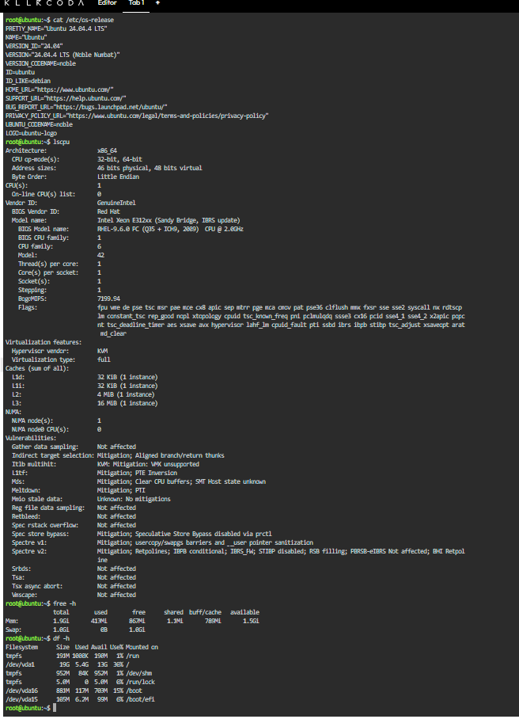

# Laboratory 03: Multi-Cloud Explorer

**Author:** OLIVER V. TABOBO  
**Course/Section:** BSIT 4F  
**Repository:** CCM101-TABOBO

---

## Mission Overview

This laboratory activity explores the core capabilities, global infrastructure, and management consoles of the three leading public cloud platforms: **Amazon Web Services (AWS), Microsoft Azure, and Google Cloud Platform (GCP).** It also includes cloud service comparisons, business scenario recommendations, and a Linux server investigation using KillerCoda to understand how on-premise systems can be mapped to cloud services.

---

## Folder Contents

- `README.md` – Laboratory overview and Checkpoint 7 Linux Investigation
- `aws-research.md` – Research and analysis on Amazon Web Services
- `azure-research.md` – Research and analysis on Microsoft Azure
- `gcp-research.md` – Research and analysis on Google Cloud Platform
- `cloud-platform-comparison.md` – Platform comparison and equivalent cloud services table
- `client-recommendations.md` – Business scenario recommendations and Decision Matrix
- `reflection.md` – Personal learning reflection
- `screenshots/` – AWS, Azure, GCP, GitHub, and KillerCoda screenshots

---

# Checkpoint 7: Linux Investigation Results

## System Information Summary

The following information was collected from my KillerCoda Linux environment.

| Component | Result |
|-----------|--------|
| **Operating System** | Ubuntu 22.04 LTS |
| **CPU Information** | x86_64 architecture with a multi-core virtual CPU |
| **Memory (RAM)** | Approximately **2.0 GB** |
| **Disk Space** | Approximately **30 GB** root partition |

### KillerCoda Terminal Evidence

> Insert your terminal screenshot below.

---

## Cloud Hosting Equivalent Analysis

If this Linux server were migrated to the cloud, it could be hosted using equivalent Infrastructure-as-a-Service (IaaS) virtual machines from each cloud provider.

| Cloud Provider | Recommended Service |
|----------------|---------------------|
| **AWS** | Amazon EC2 (`t3.micro` or `t3.small`) |
| **Microsoft Azure** | Azure Virtual Machines (`B1ms` or `B2s`) |
| **Google Cloud Platform** | Compute Engine (`e2-small` or `e2-medium`) |
