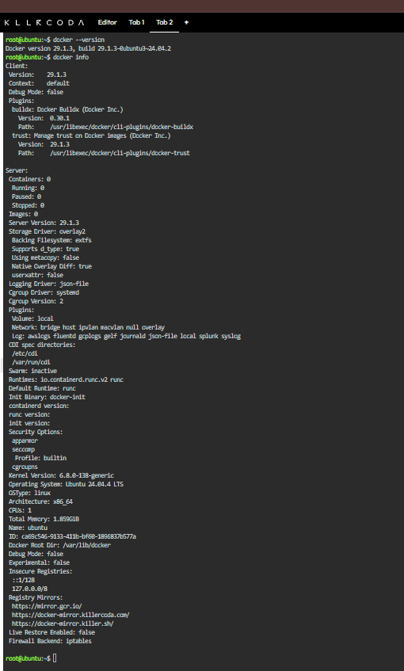
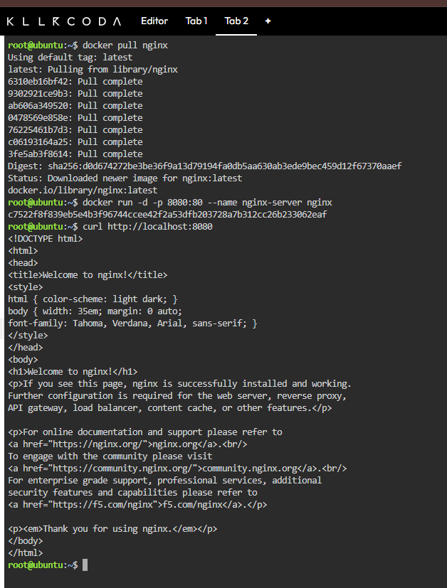
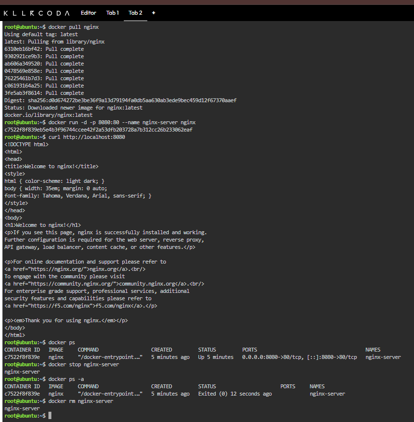

# Docker Deployment

## 1. Verify Docker Installation

### Command

```bash
docker --version
```

### Explanation

This command displays the installed Docker version and verifies that Docker is available in the KillerCoda environment.

### Command

```bash
docker info
```

### Explanation

This command displays detailed information about the Docker environment and can be used to check whether the Docker engine is operational.

---

## 2. Pull the Nginx Image

### Command

```bash
docker pull nginx
```

### Explanation

This command downloads the official Nginx image from Docker Hub so that it can be used to create an Nginx container.

---

## 3. Run the Nginx Container

### Command

```bash
docker run -d -p 8080:80 --name nginx-server nginx
```

### Explanation

This command creates and starts an Nginx container in detached mode while mapping host port `8080` to container port `80`.

### Command Breakdown

* `docker run` – Creates and starts a new container.
* `-d` – Runs the container in detached/background mode.
* `-p 8080:80` – Maps host port `8080` to port `80` inside the container.
* `--name nginx-server` – Gives the container the name `nginx-server`.
* `nginx` – Specifies the Nginx image used to create the container.

---

## 4. Verify the Nginx Web Server

### Command

```bash
curl http://localhost:8080
```

### Explanation

This command sends an HTTP request to port `8080` on the local host and verifies that the Nginx web server inside the container is responding.

A successful request should display the HTML content of the Nginx welcome page.

---

## 5. Container Lifecycle

### List Running Containers

```bash
docker ps
```

This command lists the Docker containers that are currently running.

### Stop the Container

```bash
docker stop nginx-server
```

This command stops the running Nginx container.

### Verify That the Container Is Stopped

```bash
docker ps -a
```

This command displays all containers, including stopped containers, allowing the status of `nginx-server` to be verified.

### Remove the Container

```bash
docker rm nginx-server
```

This command permanently removes the stopped `nginx-server` container from the Docker environment.

## Screenshots

### Docker Environment



The screenshot above provides evidence of the Docker version and Docker environment status.

### Nginx Running



The screenshot above provides evidence that the Nginx web server responded successfully to the local HTTP request.

### Container Lifecycle



The screenshot above provides evidence of the container lifecycle commands, including listing, stopping, verifying, and removing the container.
